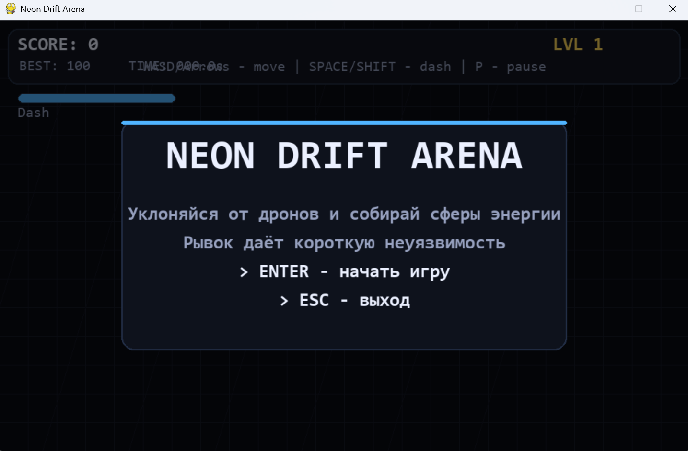
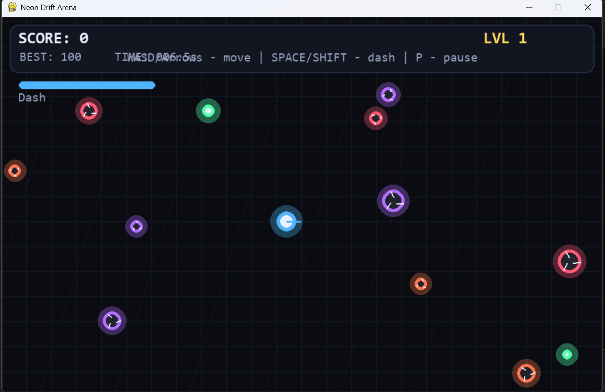
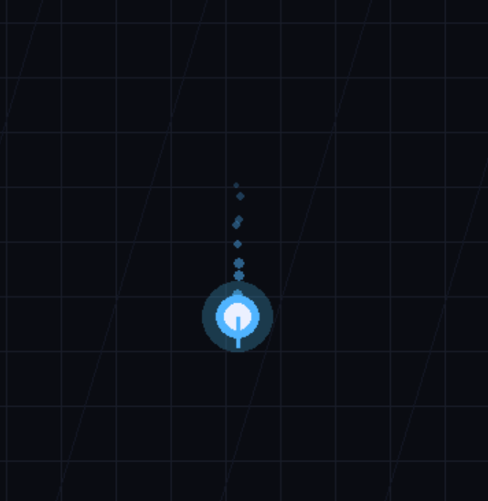
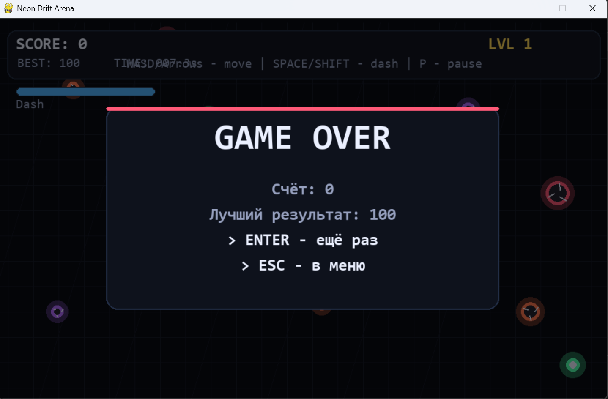

# Neon Drift Arena

> Динамичная 2D mini-game на **Python + Pygame** в неоновом стиле: уклонение от вражеских дронов, рывок с кулдауном, сбор сфер энергии, комбо-система и постепенный рост сложности.

---

## О проекте

**Neon Drift Arena** — это аркадная игра на выживание, в которой игрок управляет неоновым ядром и старается продержаться как можно дольше на арене, заполненной вражескими дронами.

Основная задача:
- **уклоняться от врагов**
- **использовать рывок (dash) в нужный момент**
- **собирать сферы энергии**
- **набирать очки и удерживать комбо**
- **улучшать свой рекорд**

Проект сделан как **самостоятельный pet-project** для портфолио и практики разработки игр на Python:
- без внешних игровых движков
- без сторонних ассетов
- без нейросетевых зависимостей
- с акцентом на чистую логику, визуальные эффекты и удобный игровой цикл

---

## Скриншоты / Демо

> Ниже оставлены места под скриншоты. Просто добавь изображения в папку `screenshots/` и замени файлы.

### Главное меню


### Игровой процесс


### Сбор сферы энергии / комбо


### Game Over / результат


---

## Основные фишки

- ⚡ **Плавное управление**
  - движение на `WASD` / стрелках
  - инерционное ощущение движения

- 🚀 **Рывок (Dash)**
  - активируется по `Space / Shift`
  - имеет **кулдаун**
  - даёт **короткую неуязвимость**, что позволяет прорываться через опасные зоны

- 🎯 **Система очков**
  - очки начисляются за выживание
  - дополнительные очки за сбор сфер энергии
  - бонусы за удержание **комбо**

- 📈 **Рост сложности**
  - игра ускоряется со временем
  - враги появляются чаще
  - выживать становится всё сложнее с каждой минутой

- ✨ **Визуальные эффекты**
  - неоновое свечение объектов
  - частицы при взаимодействиях
  - тряска камеры при ударах и подборе бонусов
  - анимированный фон и UI

- 💾 **Сохранение рекорда**
  - лучший результат сохраняется в `save_data.json`
  - рекорд доступен при следующем запуске

---

## Геймплей (как это работает)

Игрок появляется в центре арены и начинает движение по полю.  
На поле постепенно появляются враги-дроны, которые движутся по своим траекториям и отскакивают от границ арены.

Дополнительно появляются **сферы энергии**:
- сбор сферы даёт очки
- несколько подборов подряд активируют **комбо**
- чем выше комбо, тем больше бонус за каждую следующую сферу

Ключевой элемент выживания — **dash**:
- помогает резко сменить позицию
- позволяет избежать столкновения в последний момент
- требует тайминга из-за кулдауна

Игрок проигрывает при столкновении с врагом (если не находится в окне неуязвимости после рывка).

---

## Технологии

- **Python** (рекомендуется `3.12`)
- **Pygame** (`2.6+`)

### Почему именно Pygame
Проект сделан на Pygame, потому что это:
- быстрый способ собрать рабочую 2D игру
- отличный инструмент для практики игровой логики
- удобная библиотека для учебных и портфолио-проектов

---

## Запуск проекта

### Рекомендуемая версия Python
> **Python 3.12** (или 3.11)  
> На Python 3.14 `pygame` может не установиться из-за отсутствия готового wheel-пакета.

### Windows (CMD)
```bash
py -3.12 -m venv venv
venv\Scripts\activate.bat
python -m pip install --upgrade pip setuptools wheel
pip install -r requirements.txt
python main.py
